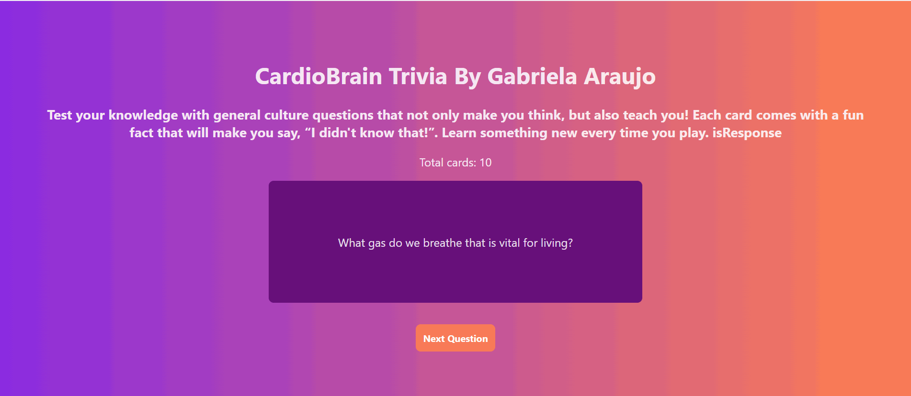

# Web Development Project 2 – **CardioBrain Trivia**

Submitted by: **Gabriela Araujo**

This web app: **CardioBrain Trivia** is a fun and educational flashcard app designed to work out your brain with general knowledge questions and surprising fun facts. Each card flips to reveal an answer plus a curiosity that keeps you learning in a playful way.

Time spent: **2.5 hours** spent in total

---

## Required Features

The following **required** functionality is completed:

- [x] **The app displays the title of the card set, a short description, and the total number of cards**
  - [x] Title of card set is displayed 
  - [x] A short description of the card set is displayed 
  - [x] A list of card pairs is created
  - [x] The total number of cards in the set is displayed 
  - [x] Card set is represented as a list of card pairs (an array of dictionaries where each dictionary contains the question and answer is perfectly fine)
- [x] **A single card at a time is displayed**
  - [x] Only one half of the information pair is displayed at a time
- [x] **Clicking on the card flips the card over, showing the corresponding component of the information pair**
  - [x] Clicking on a card flips it over, showing the back with corresponding information 
  - [x] Clicking on a flipped card again flips it back, showing the front
- [x] **Clicking on the next button displays a random new card**

## Optional Features

The following **optional** features are implemented:

- [ ] Cards contain images in addition to or in place of text
- [ ] Cards have different visual styles such as color based on their category

## Additional Features

* [x] Each answer is followed by a fun fact to enrich learning and engagement.
* [x] Card flips are reset to the front when a new question is loaded, ensuring consistent user experience.
* [x] Flashcard data is stored in an external JSON file for easy updates and clean separation of data and logic.

## Video Walkthrough

Here's a walkthrough of implemented required features:

GIF created with **ScreenToGif** (Windows)

## Notes

Challenges I faced during development:
- Resetting the flip state correctly when switching cards, while only using `useState`.
- Structuring clean component communication without overcomplicating logic.
- Designing a clean card display that clearly separates question, answer, and fun fact without visual overload.

## License

    Copyright 2025 Gabriela Araujo

    Licensed under the Apache License, Version 2.0 (the "License");
    you may not use this file except in compliance with the License.
    You may obtain a copy of the License at

        http://www.apache.org/licenses/LICENSE-2.0

    Unless required by applicable law or agreed to in writing, software
    distributed under the License is distributed on an "AS IS" BASIS,
    WITHOUT WARRANTIES OR CONDITIONS OF ANY KIND, either express or implied.
    See the License for the specific language governing permissions and
    limitations under the License.
